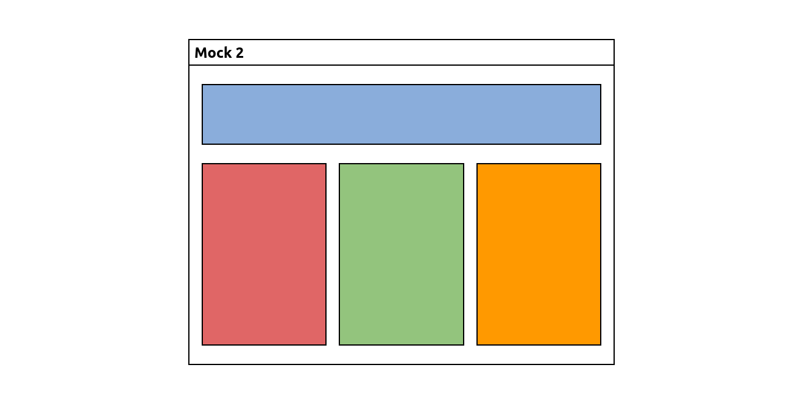
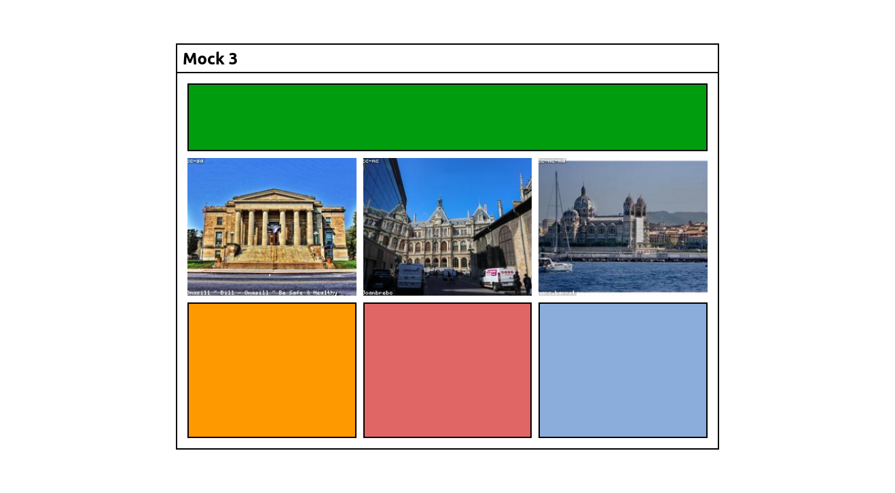

# Rithm School | CSS Layout Exercise
## Write the necessary HTML and CSS to create the following layout (Flexbox)

## Write the necessary HTML and CSS to create the following layout (Floats)

## Write the necessary HTML and CSS to create the following layout (CSS Grid Layout)

## License
[MIT](https://choosealicense.com/licenses/mit/)
